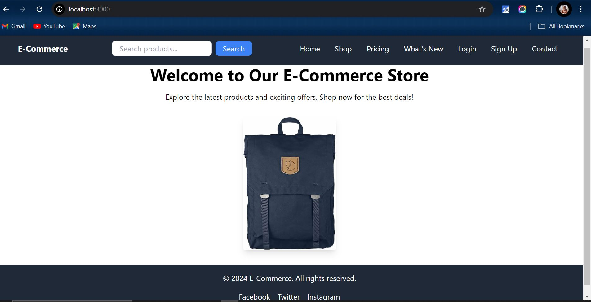

## 🛒 E-Commerce Store with Next.js

Welcome to our E-Commerce Store project built with Next.js and Tailwind CSS. This project demonstrates how to build a modern, responsive e-commerce website that includes dynamic routing, API integration, and server-side rendering (SSR) for real-time data fetching.

## 🌍 Live Demo
Check out the live version of the website:
Live Site Link

## 🎨 Project Showcase
Check out a glimpse of the project in action:

## 🛠️ Technologies Used
- Next.js: Framework for server-rendered React applications.
- TypeScript: Strongly typed JavaScript for better code quality.
- Tailwind CSS: Utility-first CSS framework for styling.
- Next/Image: Optimized image loading for improved performance.
- SSG/SSR: Static Site Generation and Server-Side Rendering for faster page loads.

## 🌟 Features
- Responsive Design: Works across mobile, tablet, and desktop devices.
- Dynamic Routing: Product pages are dynamically generated based on URL parameters.
- API Integration: Products fetched from Fake Store API.
- Static Site Generation (SSG): Product list pages pre-rendered at build time.
- Server-Side Rendering (SSR): Real-time data fetching for product details.

## 🚀 Getting Started
Follow these steps to run the project locally.

1. Clone the Repository
git clone git@github.com:faridafaqiri/advnaced_next.js_app.git
cd ecommerce-store

2. Install Dependencies
npm install

3. Run the Development Server
npm run dev
Now, open http://localhost:3000 in your browser to see the app in action.

4. Build for Production
To build the project for production:
npm run build
npm run start

## 📦 API Integration
We use the Fake Store API for fetching product data. You can see product images, prices, and descriptions dynamically displayed on the product pages.

## 👩‍💻 Author
You can contact me through the following:
LinkedIn: (https://www.linkedin.com/in/farida-faqiri-071a31309/)

Email: (farida.faqiri2@gmail.com)